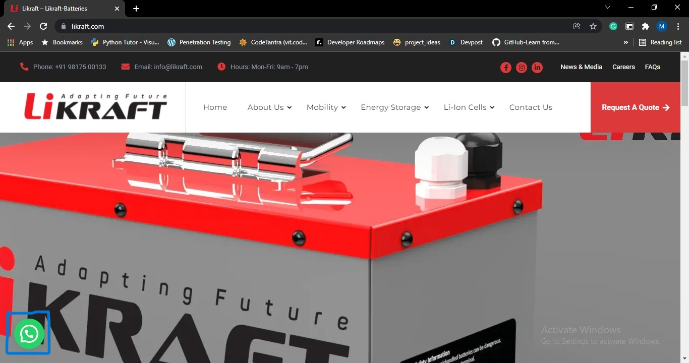

# **Whatsapp Bot**

This is a bot created for [Likraft](https://likraft.com/) 


## Demo
---
[](./img/2.mp4)

## Setup
```
.\python_whatsapp_bot\Whatsapp_bot.py
```


```
                                    │
                                    │ ┌─────────────────────────────┐
                                    │ │  Expopse a web server on    │
                                    │ │  port 5000 of your local    │
                                    │ │  machine to the internet    │
                                    │ └─────────────────────────────┘
                                    │
                                    ▼
```

```
ngrok http https://localhost:5001
```


```
                                    │
                                    │ ┌─────────────────────────────┐
                                    │ │ Paste it as the webhook url │
                                    │ │ for incomming messages in   │
                                    │ │ your sandbox                │
                                    │ └─────────────────────────────┘
                                    │
                                    ▼
```


## **Tasklist**💪
| Projects  | Status |
| ------------- | ------------- |
|  Whatsapp_bot using Twilio API | ✅  |
|  Making CRUD api with full auth for whatsapp bot service | ⬜  |
|  Deploying in a containerized environment | ⬜  |
